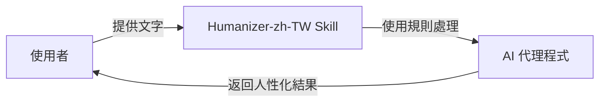
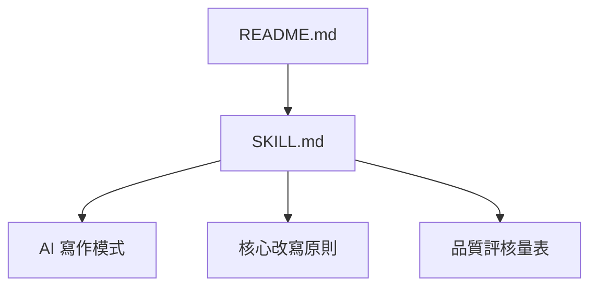
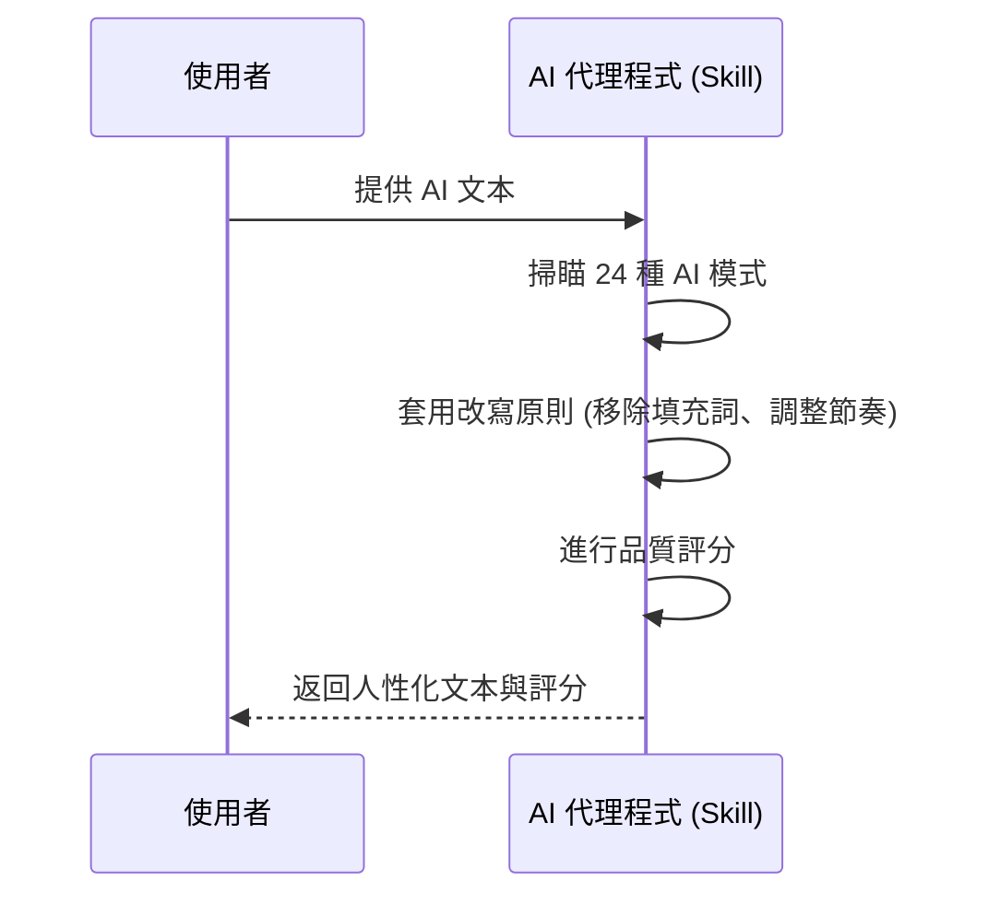
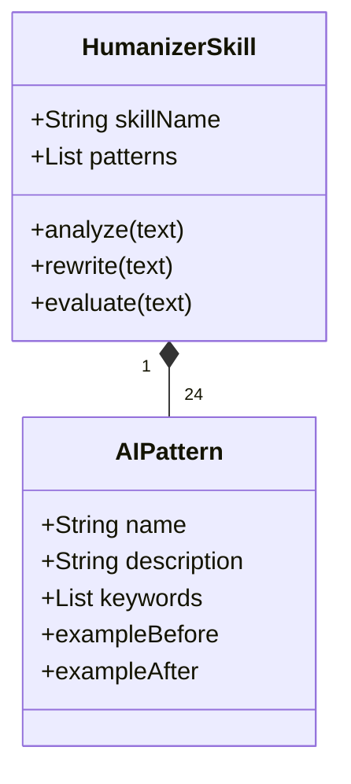
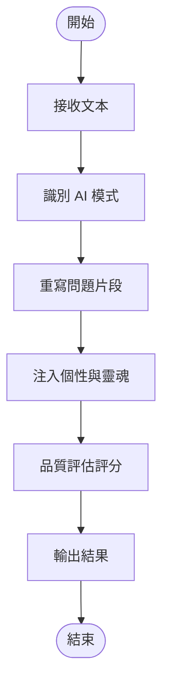
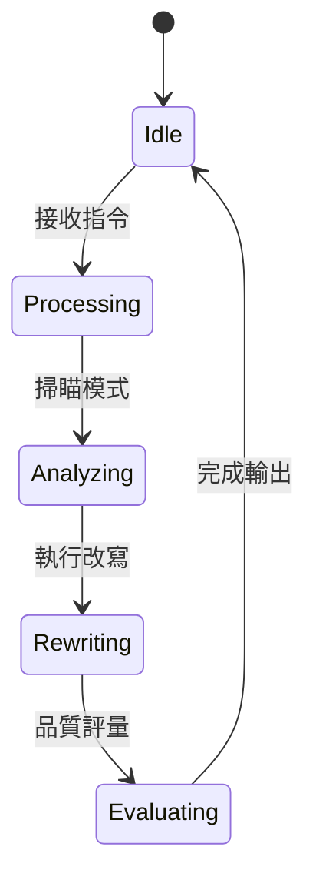

# Humanizer-zh-TW 規格文件 (spec.md)

## 1. 架構與選型
本專案為一個 AI 技能（Skill），主要透過 `SKILL.md` 定義 AI 代理程式（如 Claude Code）在處理文字時應遵循的規則與模式。
- **技術選型**：Markdown 定義檔、AI 提示工程 (Prompt Engineering)。
- **適用環境**：支援 `SKILL.md` 載入功能的 AI 開發環境。

## 2. 資料模型
本專案不涉及資料庫，其資料模型為純文字流：
- **輸入 (Input)**：AI 生成的原始文字、專案文件。
- **處理規則 (Rules)**：24 種 AI 寫作模式識別規則。
- **輸出 (Output)**：人性化改寫後的文字、品質評分表。

## 3. 關鍵流程
1. **輸入接收**：接收使用者提供的 AI 生成文字或讀取指定文件。
2. **模式識別**：根據 24 種预定義模式（如：過度強調意義、AI 常用詞彙等）進行掃瞄。
3. **人性化改寫**：
    - 移除填充句。
    - 打破公式化結構。
    - 變化句子節奏。
    - 注入具體細節與人類觀點。
4. **品質評估**：針對直接性、節奏、信任度、真實性、精煉度進行 1-10 分的評點。
5. **結果輸出**：呈現改寫後的文字及修改摘要。

## 4. 虛擬碼
```javascript
function processHumanization(inputText) {
    // 1. 初始化模式與規則
    const patterns = loadPatterns();
    const rules = loadCoreRules();

    // 2. 識別 AI 模式
    const findings = patterns.filter(p => p.matches(inputText));

    // 3. 執行改寫
    let revisedText = inputText;
    findings.forEach(issue => {
        revisedText = applyRewrite(revisedText, issue);
    });

    // 4. 注入靈魂 (個性化調整)
    revisedText = injectVoice(revisedText);

    // 5. 品質評分
    const score = evaluateQuality(revisedText);

    return { revisedText, score };
}
```

## 5. 系統脈絡圖


## 6. 容器/部署概觀
- **部署方式**：將專案資料夾置於 `~/.claude/skills/` 或使用 `npx skills add` 安裝。
- **檔案結構**：
    - `SKILL.md`: 核心邏輯與提示定義。
    - `README.md`: 使用說明。

## 7. 模組關係圖


## 8. 序列圖


## 9. ER 圖
*不適用（本專案無資料庫實作）*

## 10. 類別圖 (關鍵邏輯)


## 11. 流程圖


## 12. 狀態圖

